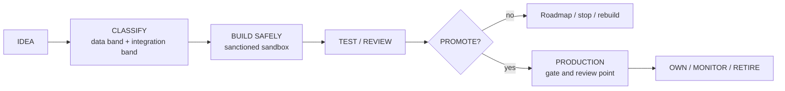

# AI-Assisted Application Development Framework

INSEAD | Version 0.1 (draft) | 3 September 2026

This repository holds the three workstream drafts and the consolidated framework that brings them together. The framework governs how an AI-assisted prototype progresses from experimentation to an institutional product, with governance increasing proportionately with risk and impact.

## Start here

1. [Consolidated framework](consolidated/00_Consolidated_Framework.md): the single testable model, terminology, tiers, controls, gate, ownership and outcomes.
2. [Gaps, contradictions and dependencies](consolidated/01_Gaps_Contradictions_Dependencies.md): what must be decided and who owns it.
3. [Scenario walkthroughs](consolidated/02_Scenario_Walkthroughs.md): four INSEAD scenarios run end to end, with the friction they exposed.
4. [Recommended changes](consolidated/03_Recommended_Changes.md): the changes the scenario testing produced, with ready-to-use wording for the clauses that matter.
5. [Minimum operating model](consolidated/04_Minimum_Operating_Model.md): how a pilot would run.
6. [White paper inputs](consolidated/05_White_Paper_Inputs.md): the material for the white paper and the decisions it must ask for.
7. [Research refresh](consolidated/06_Research_Refresh.md): what a fresh practitioner and tool sweep corroborated, and the new watchlist.

## Repository map

| Folder | Contents | Owner |
|---|---|---|
| [consolidated](consolidated/00_Consolidated_Framework.md) | The joint framework, gaps register, scenario walkthroughs, recommended changes, operating model, white paper inputs | Joint, WS1 leads the consolidation |
| [work_stream_1](work_stream_1/01_Tool_Assessment_Matrix.md) | AI development tools and safe development environments: matrix, sandbox principles, profiles, findings, sources, glossary, dependencies | Youcef |
| [work_stream_2](work_stream_2/WS2_Data_Privacy_Cybersecurity_AI_Risk_v0.3.md) | Data, privacy, cybersecurity and AI risk: classification bands, the seven framework answers, risk and control matrix | Arthur |
| [work_stream_3](work_stream_3/WS3_Prototype_to_Production_Checkpoint.md) | Prototype to production: readiness gate, ownership model, outcome routes, retirement | Salah |
| docs | The intern research brief (reference copy, not tracked in git) | Framework leads |

## Workstream 1 documents

| # | Document | Purpose |
|---|---|---|
| 01 | [Tool Assessment Matrix](work_stream_1/01_Tool_Assessment_Matrix.md) | 22 tools assessed against institutional criteria, at-a-glance verdicts, named Restricted list |
| 02 | [Sanctioned Sandbox Principles](work_stream_1/02_Sanctioned_Sandbox_Principles.md) | Sandbox definition, eight principles, user journeys, category definitions, scenario tests |
| 03 | [Tool Profiles](work_stream_1/03_Tool_Profiles.md) | Per-tool profiles with quick-reference blocks |
| 04 | [Key Findings and Recommendations](work_stream_1/04_Key_Findings_and_Recommendations.md) | Findings, numbers, trade-offs, recommendations, decisions needed |
| 05 | [Sources and References](work_stream_1/05_Sources_and_References.md) | Categorised sources, all links checked |
| 06 | [Glossary](work_stream_1/06_Glossary.md) | Shared vocabulary and acronyms across the three workstreams |
| 07 | [Dependencies and Handoffs](work_stream_1/07_Dependencies_and_Handoffs.md) | What WS1 needs from WS2 and WS3, with owners and interim assumptions |

## Consolidated documents

| # | Document | Purpose |
|---|---|---|
| 00 | [Consolidated Framework](consolidated/00_Consolidated_Framework.md) | One framework: shared terminology, derived tiers, sandbox and tool model, control set, gate, ownership, outcome routes |
| 01 | [Gaps, Contradictions and Dependencies](consolidated/01_Gaps_Contradictions_Dependencies.md) | Eight contradictions, fifteen gaps, twelve dependencies, eight decisions |
| 02 | [Scenario Walkthroughs](consolidated/02_Scenario_Walkthroughs.md) | Scenarios A to D end to end, with findings F1 to F17 |
| 03 | [Recommended Changes](consolidated/03_Recommended_Changes.md) | Changes R1 to R28 traced to findings, with drafted clause wording |
| 04 | [Minimum Operating Model](consolidated/04_Minimum_Operating_Model.md) | Pilot scope, roles, workflow, decision rights, cadence, measures, 90 day plan |
| 05 | [White Paper Inputs](consolidated/05_White_Paper_Inputs.md) | Outline, key messages, evidence table, decisions to ask for, visuals, communication risks |
| 06 | [Research Refresh](consolidated/06_Research_Refresh.md) | Targeted research sweep (agent-reach via GitHub search plus last30days), corroborating signals, new tool watchlist and sources |

## How the framework reads in one paragraph

An idea is classified by two independent scales, the data band (Red, Amber, Green) and the integration band (what the application can do to institutional systems). The higher band sets the controls and the combination sets the tier. Tier 0 is a personal experiment on public or synthetic data. Tier 1 is a registered prototype in the sanctioned sandbox using Security-approved tools with a sponsor. Tier 2 is an institutional application that passes the full production-readiness gate. Tier 3 is high-impact and adds review and a succession plan. Red data never enters prototyping. Leaving the sandbox is a promotion decision with evidence, a named business owner and a named technical owner, and it ends in one of five outcome routes: adopt, rebuild, vendor, retain learning, or stop.

## Status

Reviewed 3 September 2026.

What is complete:

- [x] Workstream 1 documents, cited and reviewed (Documents 01 to 07)
- [x] Workstream 2 and Workstream 3 drafts converted for the repository
- [x] Consolidated framework, gaps register, scenario walkthroughs, recommended changes
- [x] Minimum operating model and white paper inputs
- [x] Cross-links across all documents and a green lint pipeline
- [x] Full QA pass (3 September 2026): 16 files, 259 internal links verified with zero broken, markdownlint 0 issues, external links checked and two stale vendor URLs corrected

What is in progress:

- [ ] Confirming the eight decisions in the gaps register with the workstream leads and INSEAD functions
- [ ] Closing the remaining "To be researched" items in the tool matrix
- [ ] Confirming review capacity and pilot funding

What is needed from others:

- [ ] Security: tool approval route, model provenance process, incident path for development-time leaks
- [ ] DPO: notification threshold and telemetry position
- [ ] Legal: IP position for student-built work
- [ ] Digital/IT: identity integration, hosting standard, sandbox stand-up, review capacity
- [ ] Procurement: light route for the vendor outcome route
