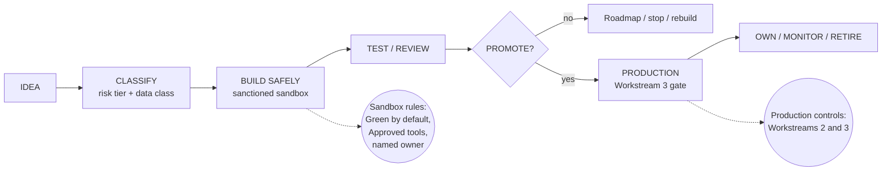

# AI-Assisted Application Development Framework: Workstream 1

AI Development Tools & Safe Development Environments
INSEAD | Version 0.1 (draft) | 3 September 2026

Workstream 1 documents: [01 - Tool Assessment Matrix](work_stream_1/01_Tool_Assessment_Matrix.md) | [02 - Sanctioned Sandbox Principles](work_stream_1/02_Sanctioned_Sandbox_Principles.md) | [03 - Tool Profiles](work_stream_1/03_Tool_Profiles.md) | [04 - Key Findings & Recommendations](work_stream_1/04_Key_Findings_and_Recommendations.md) | [05 - Sources and References](work_stream_1/05_Sources_and_References.md) | [06 - Glossary](work_stream_1/06_Glossary.md) | [07 - Dependencies and Handoffs](work_stream_1/07_Dependencies_and_Handoffs.md)

## Framework context

The framework governs how an AI-assisted prototype progresses from experimentation to an institutional product, with governance increasing proportionately with risk and impact (Intern Research Brief working principle). It applies whether a solution originates from a student, faculty member, staff member or the Digital/IT team.

Risk tiers (working hypothesis): Tier 0 personal experiment | Tier 1 internal prototype | Tier 2 institutional application | Tier 3 high-impact/sensitive.

Tool categories (this workstream): Approved | Experimental | Restricted/Prohibited.

Data classes (Workstream 2 hypothesis): Green (public/synthetic/non-sensitive) | Amber (internal) | Red (personal/confidential/student/credential/sensitive research).

Source brief: the AI-Assisted Application Development intern research brief (local working reference, not tracked in this repository).

## Documents

| # | Document | Purpose |
|---|---|---|
| 01 | [Tool Assessment Matrix](work_stream_1/01_Tool_Assessment_Matrix.md) | Evidence-based matrix assessing AI development tools against institutional criteria (SSO, training policy, audit, residency, cost, suitability), with an Approved/Experimental/Restricted outcome per tool |
| 02 | [Sanctioned Sandbox Principles](work_stream_1/02_Sanctioned_Sandbox_Principles.md) | Definition, core principles, practical implementation, category definitions and recommendations for INSEAD's safe experimentation environment |
| 03 | [Tool Profiles](work_stream_1/03_Tool_Profiles.md) | Detailed profile per tool: overview, institutional assessment, data/privacy considerations, recommendation |
| 04 | [Key Findings & Recommendations](work_stream_1/04_Key_Findings_and_Recommendations.md) | Executive summary: findings, top recommendations, decisions needed, open questions, dependencies on Workstreams 2 and 3 |
| 05 | [Sources and References](work_stream_1/05_Sources_and_References.md) | Categorised reference list (vendor docs, security/compliance, higher-ed examples, standards) |
| 06 | [Glossary](work_stream_1/06_Glossary.md) | Key terms for AI development tools and safe development environments |
| 07 | [Dependencies and Handoffs](work_stream_1/07_Dependencies_and_Handoffs.md) | What WS1 needs from Workstreams 2 and 3 and from INSEAD functions, with owners and interim assumptions |

## Status and next steps

What is complete:

- [x] Assessment matrix: 22 tools across four groups, all 15 criteria columns, named sources (Document 01)
- [x] At-a-glance verdict table with conditional verdicts (Document 01)
- [x] Sanctioned sandbox principles (Document 02)
- [x] Detailed tool profiles for every assessed tool (Document 03)
- [x] Key findings, 10 recommendations, decisions needed, open questions (Document 04)
- [x] Categorised sources with access dates (Document 05)
- [x] Glossary including cross-stream terms (Document 06)
- [x] Dependencies and handoffs with timeline and status columns (Document 07)
- [x] Case-study quick table for the four brief scenarios (Document 02, section 6)
- [x] User journeys for a student and a staff member (Document 02, section 3.6)
- [x] Mermaid diagrams of the framework pipeline and the sandbox lifecycle
- [x] Numbers in brief and accepted trade-offs (Document 04)
- [x] Quick-reference table at the top of every tool profile (Document 03)
- [x] Acronyms list (Document 06)

What is in progress:

- [ ] Closing remaining "To be researched" items (vendor pricing re-checks, Windsurf ownership status, Devin security specifics, GitHub Education entitlement changes)
- [ ] Confirming conditional verdicts with vendors through procurement (v0 by Vercel, Gemini Code Assist, Windsurf, JetBrains, Microsoft 365 Copilot)

What is needed from others:

- [ ] Arthur (WS2): final data classification, the per-tool data decision table, DPIA thresholds
- [ ] Salah (WS3): production-readiness gate and ownership model
- [ ] Legal and Procurement: DPA and indemnity review per Approved tool
- [ ] Digital/IT: identity integration and sandbox infrastructure stand-up
