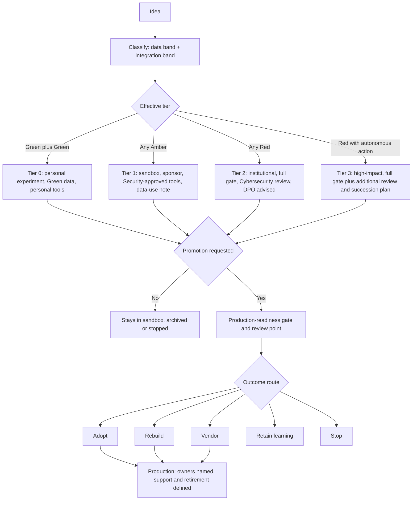

# Consolidated Framework: AI-Assisted Application Development at INSEAD

> Framework-wide documents: [00 - Consolidated Framework](00_Consolidated_Framework.md) | [01 - Gaps, Contradictions and Dependencies](01_Gaps_Contradictions_Dependencies.md) | [02 - Scenario Walkthroughs](02_Scenario_Walkthroughs.md) | [03 - Recommended Changes](03_Recommended_Changes.md) | [04 - Minimum Operating Model](04_Minimum_Operating_Model.md) | [05 - White Paper Inputs](05_White_Paper_Inputs.md)
>
> Workstream sources: [WS1 tools and sandbox](../work_stream_1/01_Tool_Assessment_Matrix.md) | [WS2 data, privacy, cybersecurity, AI risk](../work_stream_2/WS2_Data_Privacy_Cybersecurity_AI_Risk_v0.3.md) | [WS3 prototype to production](../work_stream_3/WS3_Prototype_to_Production_Checkpoint.md)
>
> Version 0.1 (draft) | 3 September 2026 | Status: leadership-ready draft for the joint review

## 1. Purpose, status and how to read this document

This document merges the three workstream drafts into one framework that can be tested against real scenarios. It does not replace the workstream documents; it states the shared model and points to them for evidence.

Every statement carries one of five labels, because the joint review needs to know what is settled and what is not:

| Label | Meaning |
|---|---|
| Existing requirement | An INSEAD policy, a legal obligation, or an approved standard that the framework must respect rather than create |
| Proposed | A position put forward by a workstream, not yet approved |
| Finding | Something the scenario testing in Document 02 revealed |
| Decision required | A choice leadership must make before the framework can be applied consistently |
| Implementation work | Practical build or process work needed to make the framework operate |

Where the three drafts disagreed, the disagreement is named here and carried into [01 - Gaps, Contradictions and Dependencies](01_Gaps_Contradictions_Dependencies.md).

## 2. Terminology and risk tiers, aligned

### 2.1 Shared vocabulary

| Term | Definition used across the framework | Source | Status |
|---|---|---|---|
| AI-assisted development | Building or changing software with AI tools, from code completion to agentic coding | WS1 glossary | Proposed |
| Sanctioned sandbox | The governed environment where Tier 0 and Tier 1 work happens, defined by policy, identity, approved tooling, dedicated repositories and review | WS1 Document 02 | Proposed |
| Tool register | The published list of tools categorised Approved, Experimental or Restricted, reviewed quarterly | WS1 Document 01 | Proposed |
| Approved tool | Institutional use permitted under defined conditions (SSO, no-training terms, audit, residency), and Security-approved as an external tool | WS1, tightened by WS2 | Proposed |
| Experimental tool | Permitted for prototyping with Green data only, on the user's own account | WS1 Document 02 | Proposed |
| Restricted tool | Not to be used for institutional work, with the reason published | WS1 Document 02 | Proposed |
| Prototype | Work that is not yet an institutional service: no real users beyond the project, no core-system write access, no institutional support obligation | WS3 section 2.1 | Proposed |
| Production | The point at which an application scales, connects to core systems, handles protected data, meets compliance requirements, or is maintained by someone other than its builder | WS3 finding 1.1 | Proposed |
| Business owner | The named INSEAD staff or faculty member accountable for the application's purpose, funding and continued existence | WS3 section 4 | Decision required (naming process) |
| Technical owner | The named person or team accountable for the application running, being maintained and being retired | WS3 section 4 | Decision required (naming process) |
| Sponsor | The faculty or staff member who vouches for a Tier 1 prototype before a formal owner exists | WS1 Document 02, WS3 tier table | Proposed |
| Promotion | The decision that moves a prototype out of the sandbox toward production | WS1, WS3 | Proposed |
| Outcome route | What happens to a validated prototype: adopt, rebuild, vendor, retain learning, stop | WS1, WS3 (identical lists) | Proposed |
| Data band | Classification of the data an application holds: Red, Amber or Green | WS2 section 4.1 | Proposed |
| Integration band | Classification of what an application can do to institutional systems: Red, Amber or Green | WS2 section 4.2 | Proposed |
| Tier 0 to 3 | The governance weight of a project | Brief, WS1, WS3 | Proposed (working hypothesis) |

### 2.2 How the two classification scales and the tiers fit together

Workstream 2 supplies two independent control inputs and one rule: the governing band is the higher of the two, because an application holding only public data can still be high risk if it can delete institutional records. Workstream 1 and Workstream 3 supply the governance weight, expressed as tiers.

| Data band | Integration band | Effective tier | What it means in practice |
|---|---|---|---|
| Green | Green | Tier 0 | Personal experiment. Public or synthetic data, no institutional integration. No formal gate. |
| Green | Amber | Tier 1 or 2 | Reading institutional data is an institutional capability, even with public data in the application. Light gate plus least-privilege credentials and logging. |
| Amber | Green | Tier 1 | Internal prototype. Security-approved tools only, no external demonstration without anonymisation, logging, sponsor named. |
| Amber | Amber | Tier 1 to 2 | Internal prototype with read access; moves to Tier 2 when real users or scale arrive. |
| Any Red | Any | Tier 2 | Institutional application. Full production gate, Cybersecurity review, DPO advised where personal data is stored. |
| Any Red | Red (automated write or delete) | Tier 3 | High-impact. Not permitted for prototypes; requires scoped credentials, full logging, rollback position and human validation on irreversible actions. |

Finding from scenario testing: the tier is derived, not chosen. A project does not "decide" it is Tier 1; the combination of its data band and its integration band places it there. The scenario walkthroughs show this removes an argument that used to be a matter of opinion.

### 2.3 Terminology differences that were resolved

| Difference | Resolution |
|---|---|
| WS2 used "Orange" in working notes; the brief and WS1 use "Amber" | Adopted Amber everywhere; WS2 already renamed it |
| WS2 says "no real institutional data during prototyping"; WS1 allows reviewed Amber data in the sandbox at Tier 1 | Named as contradiction C1 in Document 01, with a recommended resolution: allow Amber only in Security-approved tools, for Tier 1, with a data-use note, and nothing Red. The literal WS2 position would push the same work into unapproved tools, which is the shadow-AI outcome the framework exists to prevent |
| WS1 says tools are "Approved"; WS2 requires external tools to be Security-approved | Merged: a tool is Approved only when it meets the WS1 criteria and the Security team has approved the external transfer. One register, two sign-offs |
| WS3 uses "gate" for the Tier 2 threshold; WS1 uses "promotion" | Treated as the same decision: promotion is the event, the gate is the test |

## 3. The sandbox and tool model

### 3.1 Where work happens

| Layer | What it is | Who runs it | Status |
|---|---|---|---|
| Tier 0 personal experiments | Public or synthetic data, personal tool accounts, no institutional integration | The individual, with an accepted AUP | Proposed |
| Sanctioned sandbox | Tier 0 and Tier 1 work in institution-managed repositories, with the project registry and an Approved or Experimental tool from the register | Digital/IT | Proposed |
| Production | Tier 2 and 3 applications on approved hosting with SSO, owners named and the gate passed | Digital/IT with the business owner | Proposed |

### 3.2 Tool categories and their operating rules

| Category | Tools | Data allowed | Integration allowed | Conditions |
|---|---|---|---|---|
| Approved | Per the register: GitHub Copilot Business/Enterprise, Azure AI Foundry and Azure OpenAI, Cursor Teams/Enterprise with Privacy Mode, Lovable Business/Enterprise, JetBrains AI under org licensing, Amazon Q Developer Pro, Tabnine self-hosted, open-source CLIs against the institutional gateway | Green and Amber | Amber reads with least-privilege credentials | SSO, institutional accounts, content exclusions and model policy configured, audit logs retained, Security approval on file |
| Experimental | Copilot Free/Pro and GitHub Education, GitHub Models, Cursor individual, Replit free tiers, Lovable Free/Pro, Bolt.new tiers, Windsurf individual and Teams, consumer tiers of the coding CLIs, rtk | Green only | None | Personal accounts, AUP acknowledgement, no institutional credentials, project registered once it becomes Tier 1 |
| Restricted | Free consumer assistants that train on data, the Amazon Q free tier for institutional data, Replit free tiers for staff institutional work, Devin outside an Enterprise contract, any tool needing institutional credentials pasted in | None | None | Listed with reasons in the register; an approved alternative exists for each banned use |

Two additions to the register that come from WS2 rather than WS1:

| New register criterion | Why | Status |
|---|---|---|
| Model provenance, licence and version pinning | WS2 identifies supply chain and model provenance as a risk requiring verified sources, licence checks and pinned versions. A tool row that does not state which models it may call cannot satisfy this | Implementation work |
| Action capability and confirmation rules | WS2 requires that tools exposed to an agent are narrow, purpose-specific and that irreversible actions are human-validated. The register must record what each tool can do and where it runs | Implementation work |

### 3.3 Approval authority

One register, two sign-offs: Digital/IT owns the operational verdict and the quarterly review, and the Security team approves any external tool that will process institutional data, per the INSEAD Data Security Policy (KB0010486). DPO is advised wherever personal data is stored. Status: Decision required on the named approvers and the fast-track timeline.

## 4. Data, privacy, cybersecurity and AI controls

### 4.1 The seven framework questions, answered

These answers come from WS2 and are the operative rules. They are Existing requirement where they restate INSEAD policy or GDPR, and Proposed where they are WS2's working position.

| Question | Answer | Basis |
|---|---|---|
| Can I put this data into this AI tool? | Only if the tool is INSEAD-provided or an external tool explicitly approved by the Security team. No internal document or data leaves that set | Existing requirement (KB0010486) |
| Can I use real institutional data during prototyping? | Not Red. Amber only in Security-approved tools, for Tier 1, with a data-use note (recommended resolution, contradiction C1) | Existing requirement plus Decision required |
| When must synthetic or anonymised data be used? | Whenever data leaves INSEAD, including demonstrations, external tools and AI-assisted development outside internal tooling. Anonymisation must remove indirect identifiers as well as direct ones | Existing requirement plus Proposed definition |
| When does Cybersecurity become involved? | Whenever an application stores employee, student or institutional information, and whenever development causes a data leak, whether or not harm is believed to have occurred | Existing requirement |
| What changes when an application connects to an institutional system? | It inherits the source system's protections. Access must stay equivalent, so the application never becomes a route to data the user could not otherwise reach | Existing requirement |
| What additional controls apply to AI-enabled applications? | Models from trusted sources with verified provenance and licence, pinned versions, restricted access to data and systems, and the controls in 4.2 | Proposed |
| What happens when AI can act rather than generate? | Actions limited to what is strictly required, narrow purpose-specific tools, human validation before any irreversible action | Proposed |

### 4.2 AI-specific controls and when they become mandatory

| Risk | Key controls | Required from |
|---|---|---|
| Prompt injection | Normalise files to text before prompting, strip hidden-text characters, mark external content as data, human validation on external operations, gate the combination of untrusted input with sensitive data and a state change, pin tool and library versions | Any application accepting external content |
| Sensitive information disclosure | Minimise what reaches the model, synthetic or anonymised data by default, no credentials in prompts, authenticate through tools, inspect tool-call arguments and traces as well as the visible responses | All tiers, mandatory with Amber data |
| Excessive agency | Least-privilege tool set, narrow capability, user confirmation before irreversible actions, comply with the target system's policy, log all tool use, rate limit and monitor | Any Amber or Red integration |
| Supply chain and model provenance | Trusted sources only, verify provenance and licence, pin versions, behavioural testing because static analysis does not apply | All tiers, including prototyping |
| Misinformation and unreliable output | Ground answers in supplied verified sources, verify output before acting, review agent actions and arguments, review generated code before it runs against anything that matters | All tiers |

### 4.3 Traditional application controls

These apply whether or not AI is involved, and they are the part most often missing in AI-assisted prototypes.

| Area | Requirement | Required from |
|---|---|---|
| Authentication and authorisation | Local auth during development, SSO for production, a maintained library rather than custom auth, access restricted to authorised users, RBAC where entitlements differ, session tokens in httpOnly, Secure, SameSite cookies, platform secret stores for desktop apps | Any application with real users |
| Data storage | Dedicated database, secured access path, scoped credentials, no co-location with unrelated systems | Any Amber or Red data |
| Secrets | No secrets in client-side code, logs, errors, API responses or source control; approved secrets store | All tiers |
| Logging and monitoring | Log authentication, authorisation failures, access to institutional data and every change, with enough detail to reconstruct who did what; log every AI tool call with arguments and outcome; never log personal data, secrets or full prompts; protect logs at the classification of the data they describe; monitor volume and rate | Any Amber or Red data or integration |
| GDPR, retention and deletion | Lawful basis per purpose, minimisation, DPO advised where personal data is stored, leakage reported to Cybersecurity, retention period per data category, automated deletion or anonymisation at expiry including logs, caches, embeddings and backups, documented data-subject request route within one month, no training or fine-tuning on personal data without a lawful basis for that purpose | Any Red data |
| Accessibility | Baseline accessibility standard for an academic institution | Tier 2 and above |

### 4.4 The control set in one sentence

Data may only enter tools that are INSEAD-provided or Security-approved; Red data never enters prototyping; the higher of the data band and the integration band sets the controls; and every AI capability is treated as an action capability with logging, least privilege and human validation where it cannot be undone.

## 5. Promotion and production readiness

### 5.1 The gate, and how it scales

Workstream 3's checklist is the gate. It scales by tier: Tier 0 is exempt, Tier 1 uses a light version with a named sponsor, Tier 2 applies the full checklist, and Tier 3 applies the full checklist plus additional review.

| Gate area | What must be true before production | Tier from which it applies |
|---|---|---|
| Ownership | Named business owner and named technical owner, both accountable after handover | Tier 2 (sponsor at Tier 1) |
| Architecture and security review | Architecture reviewed, cybersecurity review completed, findings closed or accepted with sign-off | Tier 2 |
| Privacy and data review | Data classification confirmed, Amber or Red use approved | Tier 2 |
| Hosting and authentication | INSEAD-approved hosting, SSO integrated, no standalone credentials | Tier 2 |
| Source control and code quality | Code in an INSEAD-controlled repository, agreed quality and testing bar met, AI-generated code explicitly reviewed | Tier 2 |
| Testing | Automated coverage for core flows and a documented QA pass | Tier 2 |
| Accessibility | Baseline standard met | Tier 2 |
| Secrets management | No hard-coded credentials, approved secrets store | Tier 2 |
| Logging and monitoring | Logging, error monitoring and alerting proportional to tier | Tier 2 |
| Backup and recovery | Plan defined for any persistent data | Tier 2 |
| Deployment and change management | Documented deployment and change process | Tier 2 |
| Documentation | README, architecture note and runbook handed to the technical owner | Tier 2 |
| Support model | A defined support path for users | Tier 2 |
| Licensing, IP and procurement | IP ownership clarified, third-party terms checked | Tier 2 |
| Cost and funding | Ongoing cost identified with a budget line or owner | Tier 2 |
| Business continuity | Plan for failure of the app or of a dependency | Tier 2 |
| Retirement and decommissioning | Criteria, data handling and disposal defined at approval | Tier 2, decided at approval |

### 5.2 The promotion decision

Per WS3's answer to WS1's question: the checklist is the scalable self-serve artefact, and completion alone does not auto-approve. A small review point signs off: the incoming technical owner, a Digital/IT representative, and Andreas or a delegate. Tier 1 keeps a light self-certified check with a sponsor. Status: Proposed, with the named approvers as a Decision required.

### 5.3 Evidence pack for promotion

What a promotion request must contain, assembled from both workstreams: the filled checklist; the data and integration bands with the classification decision recorded; test evidence; the security review outcome; the accessibility check; the secrets and logging configuration; the documentation set; the named owners and support path; the cost position; and the retirement plan. Finding: no workstream currently defines who checks that the evidence is truthful rather than merely present.

## 6. Ownership, support and lifecycle

| Element | Position | Status |
|---|---|---|
| Two owners | Business owner for purpose and funding, technical owner for running and maintaining. Both required before Tier 2 production | Proposed (WS3) |
| Student-built prototypes | Ownership never rests on the student alone. On adoption it transfers to a named staff or faculty owner plus a technical owner as a condition of promotion, with the student able to contribute during handover | Proposed (WS1, WS3 agree) |
| Succession | Tier 3 requires a documented succession plan rather than a named individual alone | Proposed (WS3) |
| Abandoned projects | No owner yet. Nobody currently decides that an app is abandoned when no owner responds and there is no activity for a defined period | Decision required, open gap G1 |
| Support | A support path must exist before production; helpdesk or maintaining team | Proposed (WS3) |
| Retirement | Criteria and data handling decided when the application is approved, not later, to avoid applications retired on paper while data and integrations stay live | Proposed (WS3) |
| Lifecycle review | The register review covers tools; nothing yet reviews owned applications periodically | Implementation work |

## 7. Outcomes for validated prototypes

The five routes are identical in WS1 and WS3, which is a good sign for the merge.

| Route | When it applies | What it requires |
|---|---|---|
| Adopt or secure the prototype | Architecture sound and the tool is on the approved list | Full gate applied to the existing codebase, technical owner assigned |
| Rebuild on an approved platform | Idea validated, code or tool unsuitable | Requirements captured, rebuilt by IT or an approved team |
| Implement through an existing vendor product | An INSEAD-licensed tool already does this or could with configuration | Gap analysis, procurement engaged |
| Retain requirements and learning | Need real, timing or budget not | Findings logged to the roadmap, prototype decommissioned |
| Stop | Need not validated, risk exceeds value, cheaper alternative exists | Prototype decommissioned, data disposed of per policy |

Finding: the "stop" and "retain learning" routes are the ones that keep the framework honest, and they need an explicit owner. WS3 recommends making them normal and acceptable; the scenario testing shows reviewers still treat them as failures unless leadership says otherwise.

## 8. The framework end to end

## 9. What is settled, proposed and open

| Category | Items |
|---|---|
| Existing requirements the framework must respect | GDPR; INSEAD Data Security Policy (KB0010486); INSEAD Application Security Policy (KB0010484); INSEAD IT security policies; no institutional data outside INSEAD-provided or Security-approved tools |
| Proposed, awaiting joint approval | The sandbox model and tool register (WS1); the two-scale classification and control set (WS2); the gate, ownership model and outcome routes (WS3); promotion as a gate plus review point |
| Decisions required | See section 5 of [01 - Gaps, Contradictions and Dependencies](01_Gaps_Contradictions_Dependencies.md) |
| Implementation work | Register build and quarterly review; Security approval workflow; registry and data-use note forms; onboarding module; identity and hosting stand-up; evidence checking; abandoned-project process; retention execution for sandbox projects |

## 10. Sources

- [01 - Tool Assessment Matrix](../work_stream_1/01_Tool_Assessment_Matrix.md) and [02 - Sanctioned Sandbox Principles](../work_stream_1/02_Sanctioned_Sandbox_Principles.md): the sandbox model, categories, register criteria and recommendations.
- [WS2 - Data, Privacy, Cybersecurity and AI Risk](../work_stream_2/WS2_Data_Privacy_Cybersecurity_AI_Risk_v0.3.md): the classification scales, the seven answers, the AI and traditional control sets.
- [WS3 - Prototype to Production, Ownership and Sustainability](../work_stream_3/WS3_Prototype_to_Production_Checkpoint.md): the gate, the ownership model, the outcome routes and the retirement position.
- [06 - Glossary](../work_stream_1/06_Glossary.md): shared vocabulary, including the acronyms used across the three drafts.
